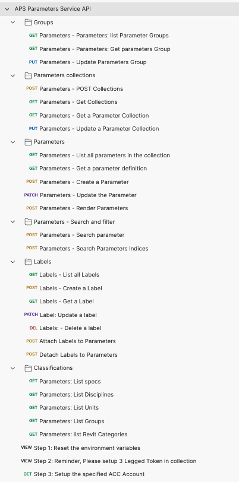

# Autodesk Parameters API List

This folder contains a Postman Collection that includes all the current Autodesk Parameters API. The collection helps you easily test these endpoints.

## Instructions to run the Postman collection are as below:

### Prerequisites
- The postman collection mainly lists all the Parameters APIs.

### Setup Postman environment and Authorization:
- Please setup the following environment vialables in **Pre-request Script** of the endpoint `Step 1: Reset the environment variables`, then run this endpoint: 
    - client_id:     APS App Id.
    - client_secret: APS App Secret.
    - hub_name: The name of ACC hub/account that you want to operate on.
    - collection_title:  The collection title that you want to operate on.
    - base_domain: https://developer.api.autodesk.com/

- Please add the 3 legged Authorization for the collection according to `Step 2: Reminder, Please setup 3 Legged Token in collection`, click **Edit Collection**, go to **Authorization** tab, make sure to use **OAuth 2.0** to get a 3 legged token of a user who has account admin access, use it in the **Request Headers**.

    - Callback URL: https://www.getpostman.com/oauth2/callback
    - Auth URL: https://developer.api.autodesk.com/authentication/v2/authorize 
    - Access Token URL: https://developer.api.autodesk.com/authentication/v2/token

### Use the endpoints under `Step 3: Setup the specified ACC Account` to set account id, then you can play with Endpoints as you want.

## Tips & Tricks
- These endpoints are mainly used to quick test|verfify based on your good understanding to Autodesk Parameters product and API, due to the API dependency, the individual endpoint may not work, you need to set up the environment variables before running the Postman request.

## License
This sample is licensed under the terms of the [MIT License](http://opensource.org/licenses/MIT). Please see the [LICENSE](../LICENSE) file for full details.

## Written by
Zhong Wu [@johnonsoftware](https://twitter.com/johnonsoftware), [Developer Advocate and Support](http://forge.autodesk.com)